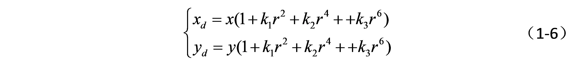
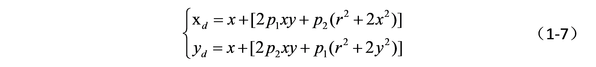

# Introduction

### 相机标定

> https://blog.csdn.net/a083614/article/details/78579163

相机标定就是标定内参和外参

内参是相机内部的参数，涉及到从相机坐标映射到像素坐标的公式中出现的参数
$$
u =  m_xf\frac{x_c}{z_c}+o_x \\
v = m_yf\frac{y_c}{z_c}+o_y
$$
把$m_xf$和$m_xf$合并成$f_x$和$f_y$，称为u、v轴的尺度因子

则

$(f_x, f_y, o_x, o_y)$便称为内参

#### 畸变

直线投影（rectilinear projection）是场景内的一条直线投影到图片上也保持为一条直线。
畸变（distortion）是不再是一条直线

- 光学畸变（optical aberration）,可能由于摄像机镜头的原因。

相机的畸变和内参是相机本身的固有特性，标定一次即可一直使用。根据镜头制造和成像的物理特性，普通镜头主要考虑径向畸变和切向畸变，且畸变模型都可以用多项式来近似。
- 径向畸变

    光线离镜头中心越远，畸变越大。以某一个中心往外延伸，且越往外，畸变越大；畸变与距离成一种非线性的变换关系，参考众多文献，可以用多项式来近似。

    

    x,y是归一化的图像坐标，即坐标原点已经移动到主点，并且像素坐标除以焦距。K1,k2,k3是径向畸变系数，r2=x2+y2（2表示2次方）。

- 切向畸变

    主要发生在相机sensor和镜头不平行的情况下；因为有夹角，所以光透过镜头传到图像传感器上时，成像位置发生了变化。

    

    x,y是归一化的图像坐标，即坐标原点已经移动到主点，并且像素坐标除以焦距。p1、p2是径向畸变系数，r2=x2+y2。

四个坐标系
- 世界坐标系（参考坐标系）
- 摄像机坐标系
- 图像物理坐标系
- 图像像素坐标系

世界坐标系到摄像机坐标系发生的是刚体变换
$$
 \left[
 \begin{matrix}
   1 & 2 & 3 \\
   4 & 5 & 6 \\
   7 & 8 & 9
  \end{matrix}
  \right] \tag{3}
$$

相机标定（Camera calibration）原理、步骤

> http://blog.csdn.net/lql0716

在图像测量过程以及机器视觉应用中，为确定空间物体表面某点的三维几何位置与其在图像中对应点之间的相互关系，必须建立相机成像的几何模型，这些几何模型参数就是相机参数。在大多数条件下这些参数必须通过实验与计算才能得到，这个求解参数的过程就称之为相机标定（或摄像机标定）。无论是在图像测量或者机器视觉应用中，相机参数的标定都是非常关键的环节，其标定结果的精度及算法的稳定性直接影响相机工作产生结果的准确性。因此，做好相机标定是做好后续工作的前提，提高标定精度是科研工作的重点所在。

常用术语

- 内参矩阵: Intrinsic Matrix
- 焦距: Focal Length
- 主点: Principal Point
- 径向畸变: Radial Distortion
- 切向畸变: Tangential Distortion
- 旋转矩阵: Rotation Matrices
- 平移向量: Translation Vectors
- 平均重投影误差: Mean Reprojection Error
- 重投影误差: Reprojection Errors
- 重投影点: Reprojected Points

1、坐标系的转换
1.1 世界坐标系
世界坐标系（world coordinate）(xw,yw,zw)(xw,yw,zw)，也称为测量坐标系，是一个三维直角坐标系，以其为基准可以描述相机和待测物体的空间位置。世界坐标系的位置可以根据实际情况自由确定。

1.2 相机坐标系
相机坐标系（camera coordinate）(xc,yc,zc)(xc,yc,zc)，也是一个三维直角坐标系，原点位于镜头光心处，x、y轴分别与相面的两边平行，z轴为镜头光轴，与像平面垂直。

1.3 世界坐标系转换为相机坐标系
⎡⎣⎢⎢⎢xcyczc1⎤⎦⎥⎥⎥=[R0t1]⎡⎣⎢⎢⎢xwywzw1⎤⎦⎥⎥⎥
[xcyczc1]=[Rt01][xwywzw1]
其中RR为3*3的旋转矩阵，tt为3*1的平移矢量，(xc,yc,zc,1)T(xc,yc,zc,1)T为相机坐标系的齐次坐标，(xw,yw,zw,1)T(xw,yw,zw,1)T为世界坐标系的齐次坐标。

1.4 像素坐标系、图像坐标系
图1：

像素坐标系（pixel coordinate）
如图1，像素坐标系uovuov是一个二维直角坐标系，反映了相机CCD/CMOS芯片中像素的排列情况。原点oo位于图像的左上角，uu轴、vv轴分别于像面的两边平行。像素坐标系中坐标轴的单位是像素（整数）。

像素坐标系不利于坐标变换，因此需要建立图像坐标系XOYXOY，其坐标轴的单位通常为毫米（mm），原点是相机光轴与相面的交点（称为主点），即图像的中心点，XX轴、YY轴分别与uu轴、vv轴平行。故两个坐标系实际是平移关系，即可以通过平移就可得到。

图像坐标系转换为像素坐标系

⎡⎣⎢uv1⎤⎦⎥=⎡⎣⎢1/dX0001/dY0u0v01⎤⎦⎥⎡⎣⎢XY1⎤⎦⎥
[uv1]=[1/dX0u001/dYv0001][XY1]
其中，dXdX、dYdY分别为像素在XX、YY轴方向上的物理尺寸，u0,v0u0,v0为主点（图像原点）坐标。

1.5 针孔成像原理
图2：

如图，空间任意一点PP与其图像点pp之间的关系，PP与相机光心oo的连线为oPoP，oPoP与像面的交点pp即为空间点PP在图像平面上的投影。
该过程为透视投影，如下矩阵表示：

s⎡⎣⎢XY1⎤⎦⎥=⎡⎣⎢f000f0001000⎤⎦⎥⎡⎣⎢⎢⎢xyz1⎤⎦⎥⎥⎥
s[XY1]=[f0000f000010][xyz1]
其中，ss为比例因子（ss不为0），ff为有效焦距（光心到图像平面的距离），(x,y,z,1)T(x,y,z,1)T是空间点PP在相机坐标系oxyzoxyz中的齐次坐标，(X,Y,1)T(X,Y,1)T是像点pp在图像坐标系OXYOXY中的齐次坐标。

1.6 世界坐标系转换为像素坐标系
s⎡⎣⎢uv1⎤⎦⎥=⎡⎣⎢1/dX0001/dY0u0v01⎤⎦⎥⎡⎣⎢f000f0001000⎤⎦⎥[R0t1]⎡⎣⎢⎢⎢xwywzw1⎤⎦⎥⎥⎥=⎡⎣⎢αx000αy0u0v01000⎤⎦⎥[R0t1]⎡⎣⎢⎢⎢xwywzw1⎤⎦⎥⎥⎥=M1M2Xw=MXw
s[uv1]=[1/dX0u001/dYv0001][f0000f000010][Rt01][xwywzw1]=[αx0u000αyv000010][Rt01][xwywzw1]=M1M2Xw=MXw
其中，αx=f/dXαx=f/dX、αy=f/dYαy=f/dY，称为uu、vv轴的尺度因子，M1M1称为相机的内部参数矩阵，M2M2称为相机的外部参数矩阵，MM称为投影矩阵。

2 相机内参与畸变参数
2.1 相机内参
参看1.6节所述
2.2 畸变参数
畸变参数(distortion parameters)

畸变（distortion）是对直线投影（rectilinear projection）的一种偏移。

简单来说直线投影是场景内的一条直线投影到图片上也保持为一条直线。

畸变简单来说就是一条直线投影到图片上不能保持为一条直线了，这是一种光学畸变（optical aberration）,可能由于摄像机镜头的原因。

畸变一般可以分为：径向畸变、切向畸变

1、径向畸变来自于透镜形状
2、切向畸变来自于整个摄像机的组装过程

畸变还有其他类型的畸变，但是没有径向畸变、切向畸变显著

畸变图示

径向畸变

实际摄像机的透镜总是在成像仪的边缘产生显著的畸变，这种现象来源于“筒形”或“鱼眼”的影响。

如下图，光线在原理透镜中心的地方比靠近中心的地方更加弯曲。对于常用的普通透镜来说，这种现象更加严重。筒形畸变在便宜的网络摄像机中非常厉害，但在高端摄像机中不明显，因为这些透镜系统做了很多消除径向畸变的工作。

对于径向畸变，成像仪中心（光学中心）的畸变为0，随着向边缘移动，畸变越来越严重。

径向畸变包括：枕形畸变、桶形畸变

切向畸变

切向畸变是由于透镜制造上的缺陷使得透镜本身与图像平面不平行而产生的。

切向畸变可分为：薄透镜畸变、离心畸变

切向畸变图示：

2.2.1 opencv中的畸变模型
径向畸变模型：
以下公式由泰勒展式得出，在opencv中K=1K=1，r2=x2+y2r2=x2+y2, (x,y)(x,y)为真实坐标（发生畸变），(x′,y′)(x′,y′)为理想坐标。

δxr=x(k1r2+k2r4+k3r6+K)
δxr=x(k1r2+k2r4+k3r6+K)
δyr=y(k1r2+k2r4+k3r6+K)
δyr=y(k1r2+k2r4+k3r6+K)
切向畸变模型：
δxd=2p1xy+p2(r2+2x2)+K
δxd=2p1xy+p2(r2+2x2)+K
δyd=2p1(r2+2y2)+2p2xy+K
δyd=2p1(r2+2y2)+2p2xy+K
理想坐标(x′,y′)(x′,y′)与真实坐标(x,y)(x,y)：
x′=x+δxr+δxd
x′=x+δxr+δxd
y′=y+δyr+δyd
y′=y+δyr+δyd
也即：

[x′y′]=(1+k1r2+k2r4+k3r6)[xy]+[2p1xy+p2(r2+2x2)2p1(r2+2y2)+2p2xy]
[x′y′]=(1+k1r2+k2r4+k3r6)[xy]+[2p1xy+p2(r2+2x2)2p1(r2+2y2)+2p2xy]
实际计算过程中，如果考虑太多高阶的畸变参数，会导致标定求解的不稳定。

2.2.2 张氏标定中的畸变模型
张正友的方法只考虑了径向畸变，没有考虑切向畸变

模型：

理想情况下(没有畸变)图片的像素坐标为：
(u,v)
(u,v)
真实的像素坐标为：
(u¯,v¯)
(u¯,v¯)
真实坐标与理想坐标的关系式（泰勒展开）：
(x,y)(x,y) and (x¯,y¯)(x¯,y¯) are the ideal (distortion-free) and real (distorted) normalized image coordinates.
x¯=x+x[k1(x2+y2)+k2(x2+y2)2]
x¯=x+x[k1(x2+y2)+k2(x2+y2)2]
y¯=y+y[k1(x2+y2)+k2(x2+y2)2]
y¯=y+y[k1(x2+y2)+k2(x2+y2)2]
其中k1k1，k2k2是径向畸变系数(coefficients of the radial distortion)。

像素坐标表示为：
u¯=u+(u−u0)[k1(x2+y2)+k2(x2+y2)2]
u¯=u+(u−u0)[k1(x2+y2)+k2(x2+y2)2]
v¯=v+(v−v0)[k1(x2+y2)+k2(x2+y2)2]
v¯=v+(v−v0)[k1(x2+y2)+k2(x2+y2)2]
即：
[(u−u0)(x2+y2)(v−v0)(x2+y2)(u−u0)(x2+y2)2(v−v0)(x2+y2)][k1k2]=[u¯−uv¯−v]
[(u−u0)(x2+y2)(u−u0)(x2+y2)2(v−v0)(x2+y2)(v−v0)(x2+y2)][k1k2]=[u¯−uv¯−v]
2.2.3 Tasi畸变模型
Tasi畸变模型同张氏畸变模型类似，也只考虑了径向畸变

## simple stereo

disparity 差距，视差

### stereo matching 立体匹配

find disparities。 目的是找出视差

算法

- SAD（sum of absolute differences）绝对差之和
- SSD（sum of squared differences）平方差之和
- 

透镜镜头的缺点或问题

- 色差
- 光晕
- 畸变

### 图像传感器

#### 种类

##### ccd传感器

charge couple devices

##### cmos传感器

