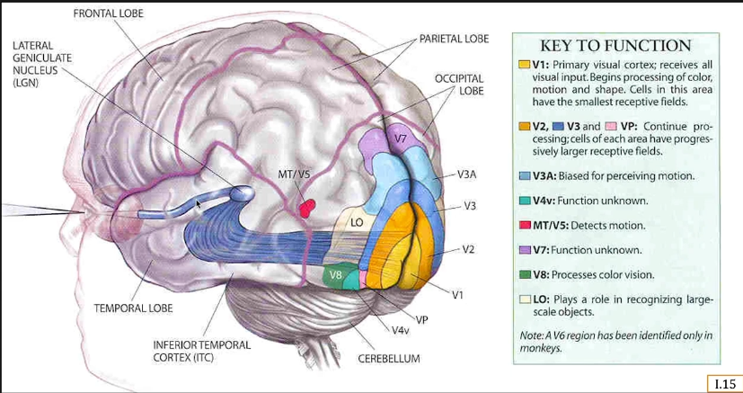
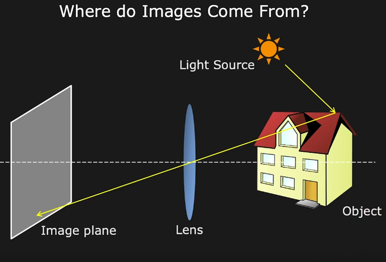

# Introduction

## Overview

略

## What is Computer Vison？

Scence definition

- Scence
- light
- Camera (人眼)
- Vision Software

Vision is

- automating human visual processes
- an information processing task
- inverting image formation
- inverse graphics

Vison Deals with Images

- Image is an Array of Pixels, A Pixel has values
  - Brightness
  - Color
  - Distance
  - Material

Vision Research

- 难题
- 多学科
- 已经取得长足进步
- 有很多现实的成功应用

## What is Vision Used for？

- Factory Automation 工厂自动化
  - guiding robot 指导机器人
  - visual inspect 视觉检查

- OCR

- Biometrics 生物识别
  - face ddetection（成熟）

- Security
  - tracking

- Human Computer Interaction 人机交互

- Visual Effects

- Augmented Reality （AR）

- Visual Search

- Autonomous Navigation 自主导航
  - 无人驾驶
  - 机器人导航

- Remote Sensing 遥感

- Medical Image Analysis

## How Do Human Do it？

人类视觉是不精确的

- Illusions （幻觉）

- ambiguities （歧义）

（人类视觉的抽象能力真的是劣势吗？）

## Topics Covered

### Images Formation and Optices

Projectiohn of 3D world on a 2D Plane

Image Sensors 图像传感器

### Image Processing

sift detector筛检器

scale invriant feature tranform

- feature detection
  - Image Alignment and Stitching 对齐拼接
  - face detection

- Radiometry and Reflectance 辐射测量和反射
  - recover 3D shape information from images of an Object
    - 同一物体的同一方向，通过不同光照下的系列图像进行三维重建。
    - 同一物体的同一方向，固定光照下的图像进行三维重建。

- Depth from Focus/Defocus
  - Active Illumination Methods 主动照明方法
  - Camera Calibration 相机矫正
  - Binocular Stereo 双目立体视觉

- Motion and Optical Flow 运动与光流

- Structure From Motion 结构与运动

- Image Segmentation 图像分割（Hard）

- Object Tracking

- Appearance Matching 外观匹配

- Artificial Neural Networks 人工神经网络

### About the Lecture Series

Modules:

0. Introdution
1. Imaging: Image Formation, Sensing, Processing
2. Features: Edges, Boundaries, SIFT, Applications
3. Reconstructions 1: Shading, Focus, Active Illumination
4. Reconstructions 2: Stereo, Optical Flow, SFM
5. Perception: Segmentation, Tracking, Recognition

Prerequisites:

- Fundamental of Linear Algebra 线代
- Fundamentals of Calculus 微积分
- One Programming Language 编程语言 

## References and Credites

### textbooks

- **Computer Vison: Algorithms and Applications **(Vison) *Szeliski, R., Springer*
- **Computer Visoin: A Modern Approach** (Vison) *Forsyth, D and Ponce, J., Prentice Hall*
- **Robot Vison** (Vison) *Horn, B. K. P., MIT Press*
- **A Guided Tour of Computer Vison**  (Vision) *Nalwa, V. Addision-Wesley*
- **Digital Image Processing** (Image Processing) *Gonzalez, R and Woods, R. Prentice Hall*
- **Optics** (Optics) *Hecht, E. , Addision-Wesley*
- **Eye and Brain** (Human Vision) *Gregory, R., Princeton University Press*
- **Animal Eye** (Biological Vision) *Land, M. and Nilsson, D., Oxford University Pross*

# Imaging Stitching 图像拼接

## Overview

: Image Formation, Sensing, Processing

Features: Edges, Boundaries, SIFT, Applications

Reconstructions 1: Shading, Focus, Active Illumination

Reconstructions 2: Stereo, Optical Flow, SFM

Perception: Segmentation, Tracking, Recognition
